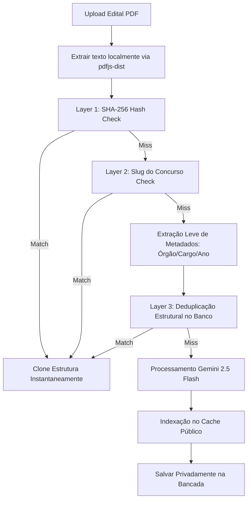

# Raio-X do Projeto PLANY 🚀

Este documento oferece um mapeamento técnico completo, arquitetural e funcional do ecossistema do **PLANY** em 2026. Ele serve como a **Fonte Única de Verdade (SSOT)** sobre as diretrizes de código, fluxos de inteligência artificial, modelagem do banco de dados e UX manifesto.

---

## 1. Manifesto de Arquitetura & UX (EduAI-Core-v2-Pro)

O PLANY é regido pela especificação **EduAI-Core-v2-Pro** e foi projetado para ser um software ultra-responsivo (**Local-First**) de alta performance para concurseiros e estudantes de elite.

### 1.1 Modelo de Visualização (Three-Column NotebookLM Inspired)
A interface é dividida em uma estrutura de dashboard de três colunas altamente integrada:
*   **Coluna Esquerda (Biblioteca & Navegação):** Hierarquia de Matérias (CRUD), Materiais (PDFs, Links, Textos), Anotações (Cadernos Tiptap) e Simulados segregados rigidamente por disciplina.
*   **Central Hub (Espaço de Foco & Chat):** Chat proativo com streaming da IA, respostas baseadas em RAG e feedbacks dinâmicos usando toasts sonoros/visuais (`sonner`).
*   **Coluna Direita (Caixa de Ferramentas de Aprendizado):** Atalhos rápidos e interativos para Quizzes, Flashcards (Algoritmo SM-2), Cronogramas e rotinas de saúde mental.

### 1.2 Princípios de Desenvolvimento Local-First
*   **Latência Zero (0ms):** A interface reflete escritas, exclusões e edições instantaneamente usando optimistic updates e IDs temporários (`temp_...`). A persistência em banco ocorre em segundo plano.
*   **Tratamento Silencioso (Silent Rollback):** Em caso de falhas de rede, o estado anterior é restaurado de forma silenciosa, alertando o usuário via Toast não-obstrutivo.
*   **Processamento Assíncrono:** Operações pesadas de IA (vetorização, OCR, web scraping) utilizam indicadores visuais sutis (glows, badges) sem travar a navegação.

---

## 2. Mapa do Banco de Dados (Drizzle Schema)

A modelagem de dados no [schema.ts](file:///c:/Users/kyper/Desktop/Projects/plany/lib/db/schema.ts) suporta segmentação rígida por matéria, cache semântico e RAG otimizado por vetores de 768 dimensões (`pgvector`).

```mermaid
erDiagram
    user ||--o{ session : possesses
    user ||--o{ account : links
    user ||--|| profiles : has
    profiles ||--o{ studyBenches : manages
    studyBenches ||--o{ subjects : contains
    studyBenches ||--o{ editalItems : contains
    studyBenches ||--o{ materials : owns
    studyBenches ||--o{ webSources : searches
    studyBenches ||--o{ quizzes : assesses
    studyBenches ||--o{ summaries : summarizes
    studyBenches ||--o{ flashcards : trains
    studyBenches ||--o{ semanticCache : caches
    
    subjects ||--o{ materials : categorizes
    editalItems ||--o{ materials : binds
    materials ||--o{ materialChunks : splits
```

### 2.1 Entidades Principais
*   **profiles:** Identifica o estudante (`concurseiro`, `universitario`, `vestibulando`, `profissional`) e seus principais pontos de dor.
*   **studyBenches:** Bancadas/Workspaces ativos de estudo. Centraliza metadados do concurso, data-alvo, horas semanais e o arquivo de edital convertido (`examNotice`).
*   **subjects:** Matérias/Disciplinas criadas pelo usuário (ex: Direito Constitucional, Língua Portuguesa).
*   **editalItems:** Tópicos do edital extraídos granulares (ex: "Artigo 5º da CF", "Crase"), mapeando o progresso (`isCovered`) de leitura de cada assunto.
*   **materials:** Documentos, links, textos ou cadernos de anotações anexados a uma bancada. Possui o hash do conteúdo (`contentHash`) para evitar re-vetorização cara.
*   **materialChunks:** Fatias de textos (~1000 caracteres) com suporte a busca vetorial via `pgvector`. Inclui indexador HNSW for máxima performance em consultas e metadados categorizados (`originTag` como "Dica", "Exemplo", "Lei", "Macete").
*   **semanticCache:** Cache de chat semântico (pergunta -> vetor -> resposta). Se o vetor de uma nova consulta for `> 0.95` similar a um cache pré-existente, a resposta é entregue a **custo zero** em 0ms.
*   **publicEditais, publicSubjects, publicTopics:** Camada de cache global público e deduplicação de editais oficiais.

---

## 3. O Motor de Inteligência Artificial & Pipeline RAG

O pipeline de IA do PLANY é agnóstico e otimizado para o máximo custo-benefício de infraestrutura.

### 3.1 Arquitetura Híbrida (Local vs. Cloud)
Implementado no [ai-service.ts](file:///c:/Users/kyper/Desktop/Projects/plany/lib/ai-service.ts), o PLANY equilibra perfeitamente poder de nuvem e custo local:
*   **Modelo de Produção/Nuvem (Estável 2026):** `gemini-2.5-flash` é o motor principal. Sua vasta janela de contexto e velocidade superior o tornam ideal para análise de PDFs massivos e geração estruturada.
*   **Modelo Local (Desenvolvimento/Offline):** Suporta integração direta com instâncias locais do `Ollama` (ex: Llama 3 para chat e `all-minilm` para embeddings locais).
*   **Fallback Automático:** Em caso de estouro de quota ou limite de requisições (HTTP 429), o sistema faz o fallback automático para modelos secundários com *exponential backoff*.

### 3.2 Ingestão & Pipeline RAG Cirúrgico (Vetorização)
1.  **Fatiamento Lógico (`chunkMarkdown`):** Divisão de textos respeitando tags Markdown para evitar corte de frases jurídicas importantes ao meio.
2.  **Embeddings:** Geração de vetores usando o modelo `gemini-embedding-2` (dimensões: 768) persistidos na tabela `materialChunks`.
3.  **RAG Cirúrgico:** As buscas no chat realizam buscas por cosseno no banco de dados via pgvector, trazendo estritamente os **top 5 chunks** mais relevantes do assunto filtrado, reduzindo o consumo de tokens de contexto da IA em até 90%.
4.  **Classificação de Nós (`classifyChunk`):** A IA classifica a natureza do fragmento ("Macete", "Lei", "Dica" ou "Exemplo"), enriquecendo as respostas do RAG.

---

## 4. Fluxos de Trabalho Principais (Core Workflows)

### 4.1 Validação e Deduplicação no Garimpo de Editais (3 Camadas)
Ao carregar um edital PDF, o sistema orquestra um fluxo cirúrgico de cache para evitar processamento redundante:

*   **Layer 1 (Arquivo ID):** Compara o hash do documento. Se for idêntico, clona instantaneamente.
*   **Layer 2 (Slug Amigável):** Compara o padrão normalizado do concurso.
*   **Layer 3 (Deduplicação Estrutural):** Identifica se o Órgão, Ano e Cargo coincidem estruturalmente. Se sim, clona a taxonomia de tópicos e matérias públicas para a bancada privada do usuário a custo zero de IA!
*   **Enforcement de Tópicos Vazios:** O sistema bloqueia requisições externas de garimpo de materiais para disciplinas que possuam **0 tópicos** definidos, prevenindo queries genéricas e de alto custo financeiro.

### 4.2 Web Research & Categoria Dorks (Material Scraper)
*   **Geração de Queries Avançadas (Google Dorks):** Para cada tópico de estudo, a IA cria dorks cirúrgicos ancorados estritamente à disciplina do contexto (excluindo ruídos como editais velhos, gabaritos e páginas de notícias de concursos).
*   **Scraping com Firecrawl:** Integração direta com `Firecrawl` no [web-scraper.ts](file:///c:/Users/kyper/Desktop/Projects/plany/lib/services/infrastructure/web-scraper.ts) consumindo resultados do Google Dorks, filtrando e analisando autoridade acadêmica, salvando o markdown sanitizado.

---

## 5. Ferramentas do Aluno (Learning Tools)

### 5.1 Flashcards com Algoritmo SM-2 (Repetição Espaçada)
*   Persiste o progresso no banco (`flashcards` e `flashcardAttempts`).
*   Calcula o próximo intervalo de revisão baseado no fator de facilidade (`easeFactor`), número de repetições bem-sucedidas e no feedback do usuário (0 a 5).
*   Garante revisões programadas exatas, otimizando a curva do esquecimento de Ebbinghaus.

### 5.2 Quizzes e Simulados Contextuais
*   A IA extrai o conteúdo programático do edital ou caderno selecionado e gera perguntas desafiadoras de múltipla escolha em formato Markdown.
*   Suporta rastreamento de nível de confiança por questão ("Certo", "Duvidoso", "Chutando"), oferecendo relatórios de vulnerabilidade de conhecimento do aluno no dashboard.

### 5.3 Cadernos (Tiptap Notes Integration)
*   Editor rich-text acoplado às disciplinas.
*   Toda anotação ou resumo gerado pela IA é sanitizado e inserido no editor utilizando a API `editor.markdown.parse(content)` para mitigar bugs de quebra de renderização e garantir fidelidade visual.

---

## 6. Padrões de Código e Guia de Contribuição

*   **Camada de Serviços (Server Actions):** Todo acesso ao banco de dados Drizzle deve residir em `lib/actions/`. É expressamente proibido fazer consultas ou mutações diretas em componentes.
*   **ActionResponse Padronizado:** Toda Server Action retorna o formato unificado `{ success: boolean; data: T; message: string; error?: string }` usando os utilitários `actionSuccess` ou `actionError`.
*   **Tipagem estrita:** 100% dos retornos de banco e ações de IA são tipadas e validadas por esquemas robustos.
*   **Composição de Componentes:** Respeitar rigidamente os tokens semânticos de cores do Tailwind e componentes Shadcn. Nunca use `space-y-*` ou classes de cores puras (`bg-blue-500`). Use sempre `flex/gap` e tokens do tema gerenciado em `globals.css`.

---
*Este raio-x foi consolidado em 17 de Maio de 2026 para documentar a integridade, o estado técnico atual e as regras de excelência do ecossistema PLANY.*
